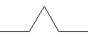
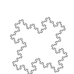
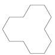

# 分形

[分形 (Fractal) ](https://en.wikipedia.org/wiki/Fractal)
是一类几何形状. 它们的特点是在任意小的尺度上都有精细的结构. 
分形通常可以由一些简单结构通过不断组合, 分裂形成, 即所谓的自相似性 
(self-similar): 任意的局部都有和整体相似的形状.
它们与传统的几何(点, 线, 多边形, 多面体等)有很大的不同, 
有许多令人吃惊的性质. 例如可以通过分形构造出封闭的几何图形, 
它们的面积是有限的, 但周长无限. 又如, 可以通过分形构造出连续但几乎处处不可微的曲线.
分形是自然界中常见的现象: 
[岛屿的海岸线](https://en.wikipedia.org/wiki/How_Long_Is_the_Coast_of_Britain%3F_Statistical_Self-Similarity_and_Fractional_Dimension), 
破碎的玻璃边缘等都体现出分形结构. 
同时, 分形在[艺术创作](http://fractalarts.com/ASF/Fractal_Art_Galleries.html),
工艺品设计, 建筑中也有用武之地. 

在这个 Project 中我们首先以 [Koch 曲线](https://en.wikipedia.org/wiki/Koch_snowflake)
为例, 介绍分形的特征. 随后简单介绍一个画图包. 在实验内容中, 你需要设计并定义一个类.
通过这个类提供的接口, 用户可以完成一些分形的绘制. 通过这个实验, 
我们希望帮助你体会使用面向对象方法解决实际问题的基本流程:

* 分析所需要解决的问题 
    * 问题是否相似? 如何划分子问题? 子问题之间的联系是什么?
* 提出恰当的抽象 
    * 不同的问题是否用到同样一组方法? 哪部分代码可以重用? 有哪些类? 哪些部分应该被隐藏, 哪些部分应该作为 API ?
* 编码设计
* 测试
* 重复迭代以上步骤

## 简介

### Koch 曲线 (Koch curves)

Koch 曲线是一种分形曲线. 以下分别是0阶, 1阶, 2阶及3阶 Koch 曲线.

    

绘制 n 阶 Koch 曲线可以通过以下算法实现:

* 绘制 n-1 阶 Koch 曲线
* 逆时针旋转 60 度
* 绘制 n-1 阶 Koch 曲线
* 顺时针旋转 120 度
* 绘制 n-1 阶 Koch 曲线
* 逆时针旋转 60 度
* 绘制 n-1 阶 Koch 曲线

### Koch 雪花 (Koch snowflake)

Koch 雪花是二维平面上由 Koch 曲线组合成的封闭图形. 
以下分别是0阶, 1阶, 2阶及3阶 Koch 雪花.

   

绘制 n 阶 Koch 雪花可以通过以下算法实现:

* 绘制 n 阶 Koch 曲线
* 顺时针旋转 120 度
* 绘制 n 阶 Koch 曲线
* 顺时针旋转 120 度
* 绘制 n 阶 Koch 曲线

问题: Koch 雪花的面积是有限的, 但周长是无限. 你能否写出周长和面积的表达式?

### StdDraw 画图包

[StdDraw 包](./src/fractal/StdDraw.java)封装了一些基本的画图方法. 
可以利用它来绘制简单的集合图形包括点, 线, 矩形, 圆等. 
详细的说明可以参见它的[文档](./docs/StdDraw.html). 
以下列出我们可能会用到的接口:

|方法  |  说明|
|--- | --- |
|StdDraw.line(double x1, double y1, double x2, double y2)   | 画一条从 (x1, y1) 到 (x2, y2) 的直线 .
|StdDraw.setXscale(double minx, double maxx)                | 画纸 X 轴最左边坐标为 minx, 最右边坐标为 maxx, 默认情况分别为0和1 |
|StdDraw.setYscale(double miny, double maxy)                | 画纸 Y 轴最下边坐标为 miny, 最上边坐标为 maxy, 默认情况分别为0和1 |

### Math 包

在绘制分形时, 往往需要计算长度和角度. 
可以使用 [Java Math](https://docs.oracle.com/javase/7/docs/api/java/lang/Math.html) 包来完成. 
我们可能会用到的函数包括: 

* 三角函数: Math.sin, Math.cos, Math.toRadians
* 幂函数: Math.pow
* 随机函数: Math.random

## 实验内容

1. 利用 StdDraw 设计一个类 Turtle, 并使用 Turtle 类画出以下三类图片 (提示: Turtle类包含数据成员(x, y)表示当前所在的坐标点, 数据成员angle表示当前画笔前进的角度, 方法turnLeft(delta)表示把当前画笔角度左转delta度, goForward(step)表示画笔从当前位置沿当前角度画一条长度为step的线).
  * 单位圆的内接正 N 边形

   

  * 螺旋线 (Spiral): 单位圆内接正 N 边形的边长随时间 t 衰减得到的曲线. 接收三个参数, N: 正 N 边形, T: 螺旋线盘旋的次数(即, 穿过第一象限的次数), D: 边长衰减的倍数.  下面分别为T=10, D=1.1, N为3, 4, 5, 6所得到的图形.

   

  * [布朗运动 (Brownian Motion)](https://en.wikipedia.org/wiki/Brownian_motion). 粒子在平面上随机选择方向移动. 接收两个参数, T: 移动次数, S: 每次移动的长度. 以下是T=1000, S=0.1时得到的四个图形.

    

2. 绘制 Koch 雪花. 接收命令行参数 N, 表示图形的阶数 (以下实验中, 参数均通过命令行给出. 提示：使用 Turtle 类).

3. 在绘制 Koch 曲线时, 将其中的顺时针替换成逆时针, 逆时针替换成顺时针. 用修改后的 Koch 曲线绘制 Koch 雪花.

4. 绘制以下分形(任选三个, 提示：使用 Turtle 类).

* Minkowski sausage

    

* Gosper island

    

* Fudge flake

    

* Levy tapestry

     
     

* Hilbert curve

    

* Sierpinski curve

    

* Dragon curve 

    

    

5. 你能否设计出自己的分形?
