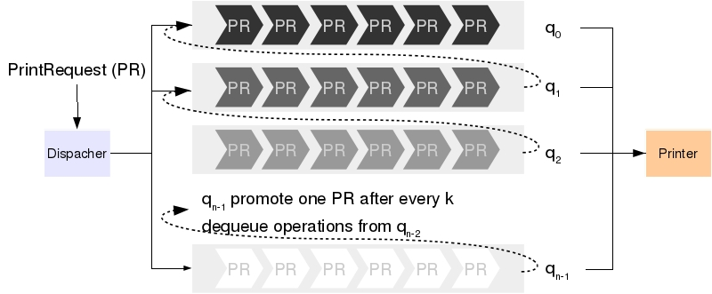

# 打印机服务程序

## 背景

假设一台打印机服务器为许多用户提供打印服务. 该打印机同一时间只能打印一份文档. 因此, 对于不同时刻送达的打印任务, 我们需要设计调度策略来安排各个任务何时被执行. 

最简单的调度策略为"先来先服务" (First in, First Serve (FIFS)), 即, 按照任务到来的先后顺序安排打印, 先来的任务先被执行. FIFS 的优点为简单, 公平(只要排队, 任何任务都会被执行). 但缺点在于对于一些耗时较小的打印任务(比如, 页数比较少的文档)会等待较长的时间 (设想你去超市买一瓶水, 发现排在你前面人买了一车食物准备冬眠). 

为了解决 FIFS 的问题, 我们可以给打印任务分配不同的优先级 (打印页数越少, 优先级越高), 不同优先级的任务放入对应优先级的队列中.
假设服务器有 $n$ 个队列 $q_0, q_1, ..., q_{n-1}$, 其中 $q_0$ 的优先级最高, 其次为 $q_1$, 而 $q_{n-1}$ 为最低优先级. 
在调度任务时, 首先从优先级最高的 $q_0$ 队列中选择任务, 若 $q_0$ 为空, 则从次高优先级的 $q_1$ 队列中选择. 以此类推. 
这样能够让耗时较小的任务优先执行, 从而提高了单位时间内能够服务的用户数量. 但"优先级"策略也带来了"饥饿"效应: 耗时较长的任务可能会永远得不到执行. 因此, 以上方案仍然需要修改.

最终的策略为"动态优先级", 即, 打印任务的优先级可以动态的更新. 如果低优先级的任务长时间没有得到执行, 
我们将提高它的优先级, 并把它加入较高优先级的队列中. 具体来说, 当一个队列 $q_i$ 被访问超过一个预先设定的次数 $k$ , 
则优先级低于 $i$ 的队列就可能存在饥饿. 因此, 此时我们会将一个低优先级队列中的任务移到队列 $q_i$ 中来提升它的优先级. 

以下为"动态优先级"调度策略的详细描述. 

  * 任何时刻, 用户都可以向服务器发送打印请求
    - 每个请求包含打印文件的文件名字, 页数.
  * 服务器根据文件页数初始化该请求的优先级, 并将该打印请求放入对应的队列中. 
    - 具体的初始化优先级算法见后续描述
  - 如果打印机空闲, 则从优先级最高的非空队列中选择请求进行打印
  - 如果打印机忙, 则让其继续打印
  - 当一个打印任务完成, 服务器将进行以下操作
    - 如果所有队列为空, 则等待新的任务到来. 
    - 如果存在队列非空, 则从优先级最高的非空队列中选择一个请求. 同时, 如果一个队列 $q_i$ 已经被访问过 $k$ 次, 则选择优先级最高非空队列 $q_j, j > i$, 从 $q_j$ 中选择一个任务将其放入 $q_i$ 中, 并清空 $q_i$的访问次数.

我们有三种策略初始化打印请求的优先级

  - A. 所有请求赋予相同优先级, 放入 $q_0$ 中. 等价于只有一个队列的 FIFS.
  - B. 使用 n 个队列, 根据文档页数分配优先级
    - 页数在 1 到 10 之间, 则进入队列 $q_0$
    - 页数在 11 到 20, 则进入队列 $q_1$
    - ...
    - 页数在 10(n-2)+1 到 10(n-1) 之间, 则进入队列 $q_{n-2}$
    - 页数超过 10(n-1), 则进入队列 $q_{n-1}$
  - C. 使用 n 个队列, 若文件页数为 t, 则进入队列 $q_{t\\%n}$

最后, 做如下假设: 有一个代表时钟的变量 `int clock`. clock 每增加1代表时钟过了1秒. 每打印一页耗时1秒.

## 实验内容

1. 定义 PrintRequest 类表示打印请求. 需要包含: 文件的名称, 页数以及发出该请求时的时间.

2. 定义 Printer 类表示打印机. 至少包含以下方法
    - `boolean printerIdle()`: 如果打印机空闲返回 true, 否则返回 false
    - `boolean printFile(PrintRequest r)`: 如果打印机空闲, 则开始处理打印任务 r, 并返回 true. 否则忽略改请求, 返回 false.
    - `PrintRequest processForOneUnit()`, 如果打印机空闲, 或者当前正在打印的文档还剩余超过1页则返回 null. 如果当前文档已完成, 则返回当前的打印任务对象. 

3. 定义 PrintQueue 类表示一个队列 (提示: 参考 Queue 接口. 主要的操作是"进队列"和"出队列". 同时 队列可能需要记录当前已经被访问了多少次).

4. 定义 PrintDispatcher 类为一个队列. 它包含 n 个 PrintQueue 对象, 而相应的"进队列", "出队列"操作则完成上述"动态优先级"策略. 包含 toString() 方法可以显示逐个队列的状态.

5. 定义 PrintSimulation 类, 模拟打印场景. 
    - 从命令行接收4个参数, 分别
        - p: 当前这1秒钟有打印请求到来的概率
        - n: 使用多少个队列
        - k: 当某个队列被访问了 k 次后, 将提升优先级
        - a: 选择哪种初始化优先级的策略 (A, B, C)
    - 模拟每一秒系统的行为. 可能出现的情况为
        - 如果打印机当前正忙, 则打印当前任务的一页.
        - 同时, 以概率 p 产生一个打印请求. 该请求的文档页数为 1 到 100 间的随机数, 发出请求的时间为当前 clock 变量的值. 该打印请求被放入 PrintDispatcher 中 (通过调用enqueue() 方法).
        - 如果打印机空闲, 且有请求正在等待, 则通过 PrintDispatcher 选择一个任务交给 Printer (通过调用 dequeue() 方法). 同时, 通过该任务的发出时间, 计算该任务的总共的等待时间. 
    - 当以上过程进行了 1000 秒后 (clock = 0, 1, ..., 999), 不再产生新的请求. 但过程将继续下去, 直到所有没有完成任务被完成. 
    - 输出所有任务中, 最长的等待时间和平均等待时间. 
    - 请绘制直方图, 横坐标表示页数 (10, 20, ..., 10(n-1), >10(n-1)), 纵坐标表示页数落在对应横坐标范围内的所有请求的平均等待时间.

6. 请**根据程序运行结果**分析不同参数对系统的影响. 

