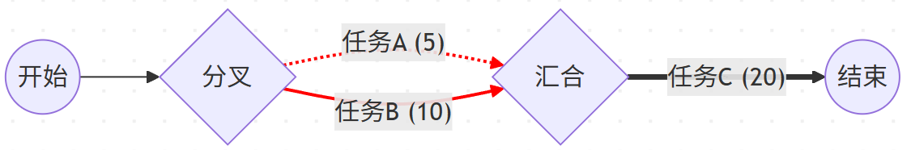

# 任务调度与执行时间分析

## 背景

在目前学习的程序中，代码通常是从 `main` 函数开始，一行一行按顺序往下执行的。这在计算机科学中被称为串行执行。但在现实世界的复杂软件中（比如每天用的网页服务器或即时聊天软件），计算机需要同时处理成千上万个任务。

在计算机系统中，处理请求通常涉及多个子任务。有些任务必须按顺序执行（例如：先打开文件，再读取内容），这称为**串行**；有些任务可以同时进行（例如：同时下载两张图片），这称为**并行**。

我们需要估算一个复杂任务组完成所需的总时间 (Make-span)。假设有了足够的计算资源：

- 串行执行：任务 B 必须在 任务 A 完成后开始。总时间等于两个任务时间之和。

  $$T_{total} = T_A + T_B$$

- 并行执行：任务 A 和 任务 B 同时开始。总时间取决于最慢的那个任务，即两个任务时间的最大值。

  $$T_{total} = \max(T_A, T_B)$$

例如，如果一个任务组由两个串行任务组成，其中第二个任务本身又是两个并行任务的组合。它的总耗时为 $T_1 + \max(T_2, T_3)$。

## 任务流

**上下文无关文法** 是一种用于定义语言结构的数学形式，在计算机科学中，它主要用于描述编程语言的语法，我们可以定义一种“上下文无关文法”来描述任务结构。

定义：

- **原子任务**: 不可再分的基本工作单位。我们用一个整数 $t$ 表示它耗费的时间，$t$ 为正整数
- $T$ 表示一个任务（可能是原子的，也可能是组合的）。
- `(S, T, T)` 表示两个任务串行执行。
- `(P, T, T)` 表示两个任务并行执行。

任务流可以按照以下规则递归定义：

1. $T = (S, T, T) \mid (P, T, T) \mid A$
2. $A = t$

其中 `|` 表示“或者”。规则 1 表示一个任务要么是串行组，要么是并行组，要么是原子任务。规则 2 定义了原子任务的耗时数值。

**示例:**

1. 耗时为 10 和 20 的两个任务串行，表示为: `(S, 10, 20)` (总耗时 30)

2. 耗时为 10 和 20 的两个任务并行，表示为: `(P, 10, 20)` (总耗时 20)

3. 下图所示的任务流（先并行执行 5 和 8，完成后再串行执行 10）：

   字符串表示为: `(S, (P, 5, 8), 10)`

   计算过程: $\max(5, 8) + 10 = 8 + 10 = 18$

4. 更复杂的嵌套：`(P, (S, 10, 10), (S, 5, 2))`

   这意味着：线程 1 串行执行两个 10ms 的任务（共 20ms）；线程 2 串行执行 5ms 和 2ms 的任务（共 7ms）；这两个线程并行跑。

   总耗时: $\max(10+10, 5+2) = 20$。

## 任务依赖图

在写代码之前，能够画出图表来分析逻辑是非常重要的能力。依赖图展示了任务之间的先后顺序。

### 画图规则

1. 用**圆圈**表示节点（开始或结束状态）。
2. 用**箭头**表示任务的执行过程，箭头上标注任务耗时。
3. **串行**：首尾相连。
4. **并行**：从同一个点分叉出去，最后在同一个点汇合（表示等待所有并行任务结束）

下图是字符串 `(S, (P, 5, 10), 20)` 对应的图：



## 实验内容

本实验分为5个部分，其中1-4部分建议自行解决，包含手动计算以及代码的编写，第五部分建议使用ai辅助完成。

### 1. 理解任务

请自行画出以下字符串表示的任务依赖图，并人工计算其总耗时：

1.`(S, (S, 2, 3), 4)`

2.`(P, 100, (S, 50, 50))`

3.`(S, (P, 10, 20), (P, 15, 5))`

4.`(P, (S, (P, 2, 2), 3), (S, 4, 4))`

### 2. 类设计与实现

定义一个抽象基类 `Task` 来表示通用的任务节点。利用**组合模式**来构建任务树。

```java
public abstract class Task {
    /**
     * 计算该任务（及其子任务）完成所需的总时间
     * @return 总耗时
     */
    public abstract int getDuration();
    
    /**
     * 返回任务的字符串表示
     */
    public abstract String toString();
}
```

你需要实现以下子类（数据成员与方法除了必要的，其余可自行设计）：

- **AtomicTask**: 继承自 Task，代表一个具体的原子任务。包含一个属性（所耗时t）以及返回t的方法等。
- **CompositeTask**: 继承自 Task 的抽象类，代表组合。包含两个 Task 对象：`left` 和 `right`，通过构造函数初始化这两个子任务。
- **SerialTask**: 继承自 CompositeTask。实现串行的时间计算逻辑。
- **ParallelTask**: 继承自 CompositeTask。实现并行的时间计算逻辑。

**要求：** 给定上述任务流的字符串表示，手动构造出相应的 Java 对象树，并调用 `getDuration()` 输出结果。

### 3.编写测试代码

在 `Main` 类中，手动通过 `new` 关键字构建出“1.理解任务”中任意几题的对象树，并打印其总耗时，验证你的计算结果是否正确。

### 4. 调度时间计算

在复杂的任务树中，子任务的相对顺序由树的结构决定，但其绝对开始时间需要从根节点向下推算。 本任务要求在 `Task` 类中增加逻辑，计算树中任意指定子任务的具体开始时间。

假设父任务的开始时间为 `t`：

1. **并行任务**：
   - 内部的两个子任务同时开始。
   - 左子任务开始时间 = `t`
   - 右子任务开始时间 = `t`
2. **串行任务**：
   - 内部子任务按顺序执行。
   - 左子任务开始时间 = `t`
   - 右子任务开始时间 = `t` + 左子任务的耗时 （必须等待左侧完成）。

请在 `Task` 类中增加以下抽象方法：

```java
/**
 * 给定整个树的开始时间，在树中找到 target 任务，并返回它的开始时间。
 * 如果没找到，返回 -1。
 */
public abstract int getStartTime(int currentStartTime, Task target);
```

**提示：请使用递归思想**

- 对于并行：左任务和右任务的开始时间，都等于父节点的开始时间。
- 对于串行 (Serial)：
  - 左任务开始时间 = 父节点开始时间。
  - 右任务开始时间 = 父节点开始时间 + 左任务的耗时。

完成代码后，请使用如下测试用例：

`(S, (P, (S, 10, 5), 20), (S, 8, 10))`

请手动构建此任务树，并分别打印出 5 个原子任务的开始时间。

### 5.自动化解析与可视化监控

#### 背景

在前面的实验中，我们通过 `new ` 手动“组装”了任务树。但在真实软件系统中，任务结构通常来自外部输入，例如配置文件、网络请求或用户指令。因此系统需要能够从字符串自动解析任务结构，并在此基础上完成执行时间分析与执行过程可视化。

这就引入了两个计算机科学中的核心概念：

**A. 编译器前端**

在编译器项目中，核心难点是如何把 `3 + 5 * 2` 这样的字符串，变成计算机能理解的指令。 在本实验中，字符串 `(S, (P, 10, 20), 30)` 就是一种领域特定语言。我们需要写一个解析器，它的工作是：“读懂”字符串，并自动调用你写好的 `Task` 类来构建对象树。

- **输入**：String
- **输出**：Task 对象 (根节点)

**B. 序列化与反序列化**

在 HTTP Server 或 Chat System 中，数据在网络上是以字节流（文本）形式传输的。

- **发送端**：把内存里的对象变成字符串（序列化）。
- **接收端**：把字符串变回内存里的对象（反序列化）。 本实验的解析器，本质上就是在这个任务系统中的“反序列化”模块。


#### 任务

本部分实验将不再要求完全手写代码，而是引入 AI （如 ChatGPT / Claude / DeepSeek）辅助开发方式。实验重点不在代码量，而在于你如何描述需求、如何验证 AI 生成代码，以及如何修正其中的逻辑问题。

请基于你之前编写的 `Task` 类代码，完成以下内容的编写。

**1.智能解析器**

输入：

```
(S, (P, 10, 20), (S, 8, 10))
```

输出任务对象树结构。

**2.执行时间分析**

系统应能计算总执行时间和每个原子任务开始时间

**3.执行时间可视化**

系统应能输出任务时间线（可选择实现方式）

例如甘特图，比如对于任务 `(S, (P, 5, 10), 20)`，可以画成如下形式：

```
Time →  0----5----10----15----20----25----30

Task A: [=====]
Task B: [==========]
Task C:           [====================]

```

也可采用其他可视化方式，例如表格、时间序列数据结构、简单图形界面或 Markdown 时间线等，可自行选择。


#### 说明

需自行编写需求描述（Prompt）给 AI，不得直接复制实验文档全文作为输入。

在描述过程中，应主动考虑一些潜在问题，例如输入字符串中可能存在空格、输入格式可能不合法、任务结构可能出现多层嵌套等情况。如果这些情况没有在需求中体现，AI 生成的代码通常无法正确处理。


#### 提交要求

实验报告需要说明你与 AI 协作完成系统扩展的过程。报告中应包含初始需求描述、AI 生成的第一版代码及其存在的问题分析，并说明如何通过修改需求描述或手动修改代码解决这些问题；**如果第一次生成代码已经完全满足所有要求，请说明你是如何构造需求描述的。**同时需要给出最终版本代码，并总结在本实验中 AI 最容易理解错误的部分，以及如何通过更清晰的需求表达减少错误。
