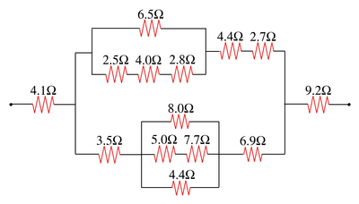

# 电阻网络

## 背景

物体的电阻 (resistance) 用来衡量当电流通过物体时会收到"阻碍".
电阻越大, 电流同过该物体时受到的阻碍就越大. 欧姆定律刻画了电阻, 电流和电压之间的关系.

$$\begin{eqnarray*}
I = \frac{V}{R}
\end{eqnarray*}$$

其中, V 表示物体两端的电压(电势差), R 为该物体的电阻, I 为通过物体的电流.电阻可以通过串联和并联的方式组合成为复杂的电阻网络:

  * 串联 (Series): 将两个电阻首尾相连. 其等效电阻等于两个电阻的和.
  * 并联 (Parallel): 将两个电阻并行排列. 其等效电阻等于倒数和的倒数.


例如, 以下网络由两个串联电阻与第三个电阻并联形成. 它的等效电阻为 $\frac{1}{\frac{1}{R_1} + \frac{1}{R_2 + R_3}}$ 


## 如何表示网络

一个通过串联和并联搭建的电阻网络可以表示成为字符串. 定义 

  * $R$ 表示单个电阻器
  * $a$ 为正数, 表示单个电阻器的取值
  * $N$ 为电阻网络
  * $(-, N, N)$ 表示两个电阻网络串联后的得到的网络
  * $(/, N, N)$ 表示两个电阻网络并联后的得到的网络 

电阻网络可以按照以下规则表示

  1. $N = (-, N, N)|(/, N, N)|R$
  2. $R = a$

其中"|"表示或者. 规则1 表示一个电路网络要么由两个网络串联而成, 要么由两个网络并联而成, 要么是单个电阻器. 规则2 表示一个电阻器的电阻取值是多少. 


下面是几个例子:

  1. 两个电阻为3和5的电阻器串联可以表示为: "(-, 3, 5)"
  2. 两个电阻为3和5的电阻器并联可以表示为: "(/, 3, 5)"
  3. 以下网络可以表示成为: "(-, (/, (/, 4, 8), 5), 3)"


  4. 以下网络可以表示成为: "(/, (-, (/, 6, 3), 2), (-, 3, 3))"


这样的表示方式称为 [上下文无关文法 (Context Free Gramma)](https://zh.wikipedia.org/wiki/%E4%B8%8A%E4%B8%8B%E6%96%87%E6%97%A0%E5%85%B3%E6%96%87%E6%B3%95), 它是在程序语言设计, 人工智能等方向有广泛应用.

## 实验内容

1. 写出下列网络的字符串表示





2. 定义 Circuit 类用来表示电路网络.

```java
public abstract class Circuit {  
    public abstract double resistance();
}
```
resistance() 返回该网络的等效电阻值. 给定网络的字符串表示, 构造相应的 Circuit 对象, 并输出它们的等效电阻值.

3. 修改 Circuit 类, 使得给定电源电压, 能够计算任意子网络两端的电势差以及流经该网络的电流.


