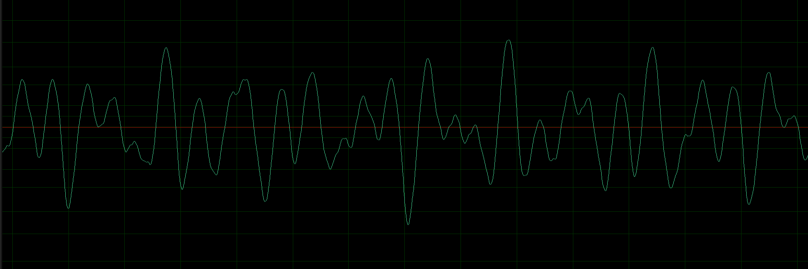

# 音频处理

在这个 project 中，你将使用 Java 对音频做一些简单处理：包括调节音量、裁剪、倒放、淡入淡出、平滑滤镜（移动平均）、回声滤镜等。你将看到，一个好的包通过提供恰当的接口（API），可以让你在不了解底层 WAV 编码与声卡 I/O 的情况下便捷完成音频编辑。我们会首先介绍音频在计算机里的表示方式，然后介绍一个音频处理类 **`StdAudio`**。

------

## 数字音频（Digital Audio）

一段数字音频在计算机里可以表示为一个数组：

- `samples[i]`：第 `i` 个采样点的振幅（amplitude），类型为 `double`，范围为 [-1, 1]
- 采样率 `SAMPLE_RATE = 44100`：每秒 44100 个采样点（也就是 1 秒对应 44100 个数组元素）

> **Clipping（截幅）**：若计算后某个采样点超出 `[-1, 1]`，播放时会被 `StdAudio` 自动截断到范围内。建议在保存前也主动做截断。

详细说明：

现实中的声音是连续的波形，是模拟量。计算机是二进制的离散机器，不能处理连续的模拟量。因此，需要把连续声音转为计算机所能理解的离散数据才行。连续的音频被称作模拟音频，而离散的音频则被称作数字音频。



- 振幅：

  如图所示，声音在不同时刻 t 下振动的幅度称为振幅。

- 采样率：

  采样是将连续信号转化到离散信号的过程。一秒采集的次数被称为采样率。声音由如图中的振动产生，振动的幅度处于不断的连续变化之中，但要将其转换到数字系统中时，则必须进行离散化，比如一秒钟之内我对原始振幅采样48000次，来模拟这种现实世界中连续的变化。

## StdAudio

`StdAudio` 提供了读取、播放、保存音频所需的核心接口。你需要查阅其 [Javadoc文档](https://introcs.cs.princeton.edu/java/stdlib/javadoc/StdAudio.html) 并理解每个方法的参数与约束，其源代码文件可以在[这里](https://introcs.cs.princeton.edu/java/stdlib/StdAudio.java)找到。

我们将会用到的部分方法总结如下:

| 方法                                               | 说明                                                         |
| :------------------------------------------------- | ------------------------------------------------------------ |
| `StdAudio.read(String filename)`                   | 读取音频文件，返回 `double[] samples`（值在 -1~1）           |
| `StdAudio.save(String filename, double[] samples)` | 保存 `double[]` 为音频文件（wav/au/aiff），固定输出格式 44100Hz/16-bit/mono/PCM 等 |
| `StdAudio.play(double[] samples)`                  | 播放采样数组（超范围会 clip）                                |
| `StdAudio.play(String filename)`                   | 直接播放音频文件（常用 wav/au/aiff）                         |
| `StdAudio.drain()`                                 | 把缓冲区里未播放完的样本发送到声卡（防止程序提前退出）       |

------

## 示例：计算音频的 RMS（均方根）音量

RMS 常用来衡量“平均能量/响度”：

$$
\text{RMS} = \sqrt{\frac{1}{n}\sum_{i=0}^{n-1} samples[i]^2}
$$

示例代码：

```java
public class RMSVolume {
    public static double rms(double[] s) {
        double sum = 0.0;
        for (double v : s) sum += v * v;
        return Math.sqrt(sum / s.length);
    }

    public static void main(String[] args) {
        double[] s = StdAudio.read(args[0]);
        System.out.println("n = " + s.length);
        System.out.println("rms = " + rms(s));
    }
}
```

------

# 实验内容

所有题目均通过命令行参数给出输入文件与输出文件（文件格式建议使用 `.wav`）。

1. 输入一个音频文件，播放这个[音频文件](audio/raw.wav)并输出：

   - 采样点数量 `n`

   - 时长（秒）：`n / 44100.0`

   - 峰值振幅 `max(|samples[i]|)`

   - RMS（均方根）

2. 音量调整。输入音频文件与系数 `k`，输出[新音频](audio/t2.wav) `out.wav`：

$$
y[i] = \text{clip}(k \cdot x[i])
$$

3. 把整段音频缩放到“峰值振幅 = 0.99”（防止爆音）。具体来说，令 `peak = max(|x[i]|)`，若 `peak == 0`则保持不变，否则 `k = 0.99 / peak`，保存新音频 `y[i] = clip(k * x[i])`
4. 输出音频的[倒放版本](audio/t4.wav)：$y[i] = x[n-1-i]$

5. 裁剪音频，给定起止时间 `t0, t1`（单位秒），输出该区间音频（如果 t1 超出时长时，裁到末尾）：

   - `s0 = floor(t0 * 44100)`

   - `s1 = floor(t1 * 44100)`

   - 输出长度 `s1 - s0`


6. 淡入淡出：给定淡入时长 `fin`、淡出时长 `fout`（秒），将裁减的中间段音频输出处理成淡入淡出的新音频：

   - 淡入区间：振幅系数线性从 0 → 1

   - 淡出区间：振幅系数线性从 1 → 0


7. 对音频施加[回声滤镜](audio/t7.wav)。给定延迟时间 `delay`（秒）与衰减系数 `a`（0~1）：

   - `d = floor(delay * 44100)`

   - 当 `i-d >= 0`，`y[i] = clip(x[i] + a * x[i-d])`。否则 `y[i] = x[i]`

8. 尝试对两段音频 $A[i]$ 和 $B[i]$ (如两种乐器、伴奏和人声)进行混音处理：
   
$$
y[i]=clip(αA[i]+βB[i])
$$

9. 在回声滤镜的基础上，将其升级为混响滤镜：
   
   ```math
   y[i]=x[i]+\sum_{k=1}^{K} a^{k},x[i-kd]
   \quad,\quad d=\lfloor delay\cdot44100\rfloor


   采用参数：delay=0.04, a=0.33, K=7

