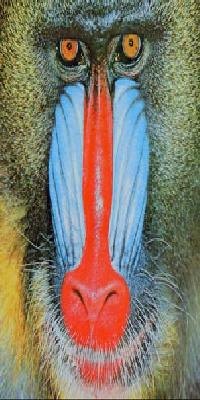

# 图像处理

在这个 project 中, 你将使用 Java 进行一些简单的图像处理任务: 包括修改图像颜色, 尺寸以及为图像增加滤镜效果等. 你将看到, 一个好的包通过提供恰当的接口 (API) 能够帮助程序员在不了解底层实现的情况下便捷高效的完成工作. 
在具体描述作业之前, 我们首先介绍 Java 内置的颜色类 (java.awt.Color), 
以及一个由其他开发者提供的图像类 [Picture.java](Picture.java).

## 颜色 

Java将颜色抽象成为 Color 类. 如果需要进行与颜色相关的操作, 
需要在源文件开头处出加入以下语句:

```java
import java.awt.Color;
```

Color 类使用[RGB模型](https://en.wikipedia.org/wiki/RGB_color_model)表示颜色. 
每种颜色被三个整数确定. 每个整数的取值范围是 0 到 255,
分别表示红, 绿, 蓝三种颜色的强度. 这三种颜色的不同组合可以产生 256^3 种不同的颜色.
下表是一些颜色的 RGB 表示:

|Color      |Red    |Green    |Blue|
|-----    |-----   |------   |-----|
|红       |  255   |     0   |    0
|绿       |    0   |   255   |    0
|蓝       |    0   |     0   |  255
|黑       |    0   |     0   |    0
|深灰     |  100   |   100   |  100
|白       |    0   |     0   |    0
|黄       |  255   |   255   |    0
|品红     |  255   |     0   |  255
|褐       |  160   |    82   |   45

创建不同的颜色需要通过 Color 类的**构造函数**和`new`操作符:

```java
Color red    = new Color(255,   0,   0);  
Color white  = new Color(255, 255, 255);  
Color sienna = new Color(160,  82,  45);
```

Color 类的提供所有方法 (API) 在 
[Java文档](http://docs.oracle.com/javase/6/docs/api/java/awt/Color.html)
中可以查询到. 其中我们可能会用到的方法总结如下. 我们建议在开始作业之前, 你可以尝试创建一些颜色, 并对所创建的颜色对象调用这些方法, 输出它们的返回值, 以便帮助你理解这些 API 的作用. 

|方法  |说明|
|---|---|
|Color(int r, int g, int b)  |Color 对象的构造函数|
|int getRed()                |获得红色的强度|
|int getGreen()              |获得绿色的强度|
|int getBlue()               |获得蓝色的强度|
|Color brighter()            |返回一个更深的颜色|
|Color darker()              |返回一个更浅的颜色|
|String toString()           |该颜色的String表示|
|boolean equals(Color c)     |是否与颜色c相同|

下面我们将以计算颜色的亮度 (Luminance) 为例, 说明如何使用 Color 类.
颜色的亮度表征了显示该颜色时需要使用多少强度的光. 直观上亮度越大, 该颜色越明亮. 
严格的定义如下:

```
亮度 = 0.299*r + 0.587*g + 0.114*b
```

其中, r, g, b分别代表该颜色的红, 绿, 蓝强度. 以下为对应的 Java 函数:

```java
import java.awt.Color;

public class Luminance {

    // return the monochrome luminance of given color
    public static double lum(Color color) {
        int r = color.getRed();
        int g = color.getGreen();
        int b = color.getBlue();
        return .299*r + .587*g + .114*b;
    }

    // test 
    public static void main(String[] args) {
        int[] a = new int[3];
        for (int i = 0; i < 3; i++) {
            a[i] = Integer.parseInt(args[i]);
        }
        Color c = new Color(a[0], a[1], a[2]);
        System.out.println("c = " + c);
        System.out.println("lum(c) =  " + lum(c));
    }
}
```

## 数字图像 

一幅数字图像 (digital image) 在计算机内部被表示成像素矩阵 (pixel matrix).
每一个像素都有自己的颜色. 类比来说, 每个像素好比拼图玩具中的一块, 
它们单个看起来都只是简单的色块, 但不同的块组合在一起就能构成完整的图画. 

在本次作业中, 我们将使用一个名为 [Picture.java](Picture.java) 的包.
它提供了对图像操作的封装. 
它的详细的文档在[这里](Picture/Picture.html). 
我们将会用到的部分方法总结如下:

|方法  |说明|
|---|---|
|Picture(String s)               |从文件 s 创建一个图像对象|
|Picture(int w, int h)           |创建一个宽为 w, 高为 h 的空白图像|
|int width()                     |获得图像的宽度|
|int height()                    |获得图像的高度|
|Color get(int i, int j)         |返回像素 (i, j) 的颜色|
|void set(int i, int j, Color c) |设置像素 (i, j) 的颜色为 c|
|void show()                     |将该图像显示在一个窗口中|
|void save(String s)             |将该图像保存为文件 s|

## 实验内容

1. 通过命令行参数给定一个图片文件, 输出它的长和宽. (以下各题中的图片文件, 参数都通过命令行参数形式给出).

2. 给定一个图片文件, 将其转换成为相应的灰度图 (Grayscale). 当 RGB 颜色模型中红绿蓝三色强度取相同值 v 时, 该颜色为灰色, 其灰度值为 v (0<= v <= 255). 图片的灰度图可以通过如下方法得到: 将图中每个像素点的颜色置为灰色, 且这些灰色的灰度值等于该颜色亮度.

     

3. 给定一个图片文件, 以及参数 w, h, 将其转换成为宽为 w, 高为 h 的图片.

     

4. 给定一个图片文件, 以及参数N. 输出 N 张图片, 其中第n张图片为从输入图片和其对应灰度图的一个渐变图. 

<!--
5. 给定一个图片文件, 输出一个它的矩形剪裁, 要求尽量去除图片中的空白边界 (automatic cropping). 
-->

5. 给定一个图片文件, 以及参数x, y, E. 输出原始图片的一个正方形裁剪, 其中正方形的中心在 (x, y), 边长是 E. x, y, E 为百分比. 例如 x=10, y=20, E=20, 表示中心位于 原始图片宽的10%, 高20%处. 边长为原始宽度的20%.

6. 给定一个图片文件, 产生该图片的一个镜像图片(关于 y 轴对称)

7. 滤镜 (filters) 可以看作对像素矩阵的某种变换. 通过添加滤镜, 我们可以改变图片的视觉效果. 请实现以下滤镜.
    * Linear filter: 每一个像素的颜色变为周围 9 个像素点(包含它本身)颜色的平均值. 这个变换等价于将矩阵 
    $$
    \begin{bmatrix}\frac{1}{9}, \frac{1}{9}, \frac{1}{9} \\ \frac{1}{9}, \frac{1}{9}, \frac{1}{9}\\ \frac{1}{9}, \frac{1}{9}, \frac{1}{9}\end{bmatrix}
    $$
    
    与 9个像素点做 *卷积 (Convolution)* . 而这个矩阵被称为卷积矩阵 (convolutional matrix). 关于卷积矩阵可以参考[1](https://en.wikipedia.org/wiki/Kernel_(image_processing)), [2](https://docs.gimp.org/2.6/en/plug-in-convmatrix.html).

    * Blur filter: 卷积矩阵为 
    $$
    \begin{bmatrix}\frac{1}{13}, \frac{1}{13}, \frac{1}{13}\\ \frac{1}{13}, \frac{5}{13}, \frac{1}{13}\\ \frac{1}{13}, \frac{1}{13}, \frac{1}{13}\end{bmatrix}
    $$
    * Emboss filter: 卷积矩阵为 
    $$\begin{bmatrix}-1, 0, 1\\ -1, 1, 1\\ -1, 0, 1\end{bmatrix}, 或者 \begin{bmatrix}1, 0, -1\\ 2, 0, -2\\ 1, 0, -1\end{bmatrix} 或者 \begin{bmatrix}-1, -1, 0\\ -1, 1, 1\\ 0, 1, 1\end{bmatrix}
    $$


    * Sharpen filter: 卷积矩阵为 
    $$
    \begin{bmatrix}0, -1, 0\\ -1, 5, -1\\ 0, -1, 0\end{bmatrix}
    $$


    * Oil painting filter: 给定参数 w, 将每个像素 (i, j) 的颜色替换为所有与 (i, j) *Manhattan 距离* 小于 w 的像素点中出现次数最多的颜色. 其中 Manhattan 距离(也称为 $l_1$ 距离)定义见 [3](https://en.wikipedia.org/wiki/Taxicab_geometry), [4](http://mathworld.wolfram.com/TaxicabMetric.html).

8. 提升一张图片的亮度 (Brightness).

9. 图片的滤镜效果可以看成像素矩阵的一种变换. 相比于使用固定的卷积矩阵, 这些复杂的滤镜可能经过了美工设计师的设计. 但无论怎样, 确定某种滤镜对应的变换, 只需确定每种颜色经过滤镜后被变换成了哪一种颜色. 选择一款手机App(比如Instagram, 足迹, 美图秀秀等) 以及其中的一个内置滤镜, 编写一个java程序来实现这个滤镜.

